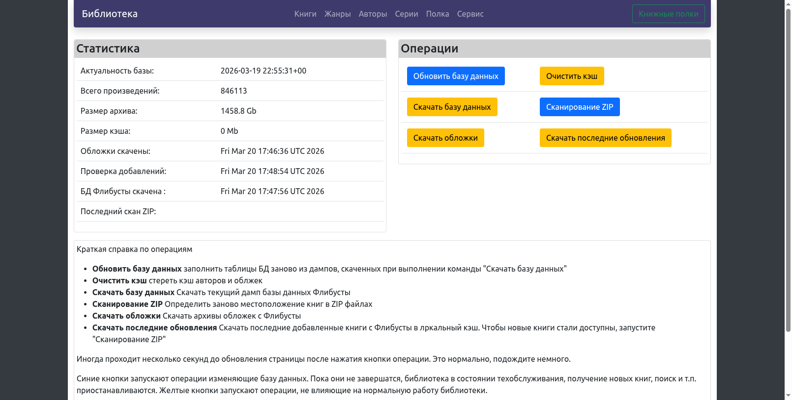

# Docker-контейнер для локальной копии Флибусты.

Отображение книг, поиск по заголовкам, сборникам, авторам, жанрам. Открываются в браузере форматы fb2, docx, rtf, mobi, epub, txt, html. Для fb2 сохраняется позиция чтения.

Возможность создания "книжных полок" для избранных книг, авторов и сборников.

Встроенный сервис OPDS для читалок.

|||||
|---|---|---|---|
## Установка:


1. Выбрать, какой вариант Вы устанавливаете - All-in-one  или external_services конфигурацию. All-in-one определяет сервисы Postgres (db) и nginx (frontend) в docker-compose.yml. **All-in-one конфигурация предоставлена только для обратной совместимости! Поскольку nginx в ней работает без HTTPS, практически безопасность отключена. Настоятельно советуем использовать external_services с прокси поддерживающим HTPS. Например swag контейнер позволяет работать с бесплатными сертификатами letsencrypt (включая автоматизацию получения и ротации сертификатов)** External_services используется в случае если уже  есть один из этих сервисов или оба. Если есть только один, позаботьтесь, чтобы второй тоже был, например скопировав соответствующий раздел из docker-compose.yaml в all-in-one.
2. Замените place holders на Ваши данные. **Обязательно замените пароли по умолчанию!**
- TZ  ваша временная зона
- FLIBUSTA_WEBROOT если URL доступа к библиотеке в виде https://myhost.org/flibusta - WEBROOT=flibusta, если https://flibusta.myhost.org или даже http://my-nas-address-in-local-net:2700/ оставьте WEBROOT пустым : WEBROOT=''
- FLIBUSTA_DBUSER, FLIBUSTA_DBNAME, FLIBUSTA_DBHOST - параметры базы данных. Они нужны только в случае external_config.
- FLIBUSTA_DBPASSWORD_FILE путь к файлу содержащему пароль для FLIBUSTA_DBUSER ( для all-in-one пароль задан в существующем в github файле в secrets, его не надо менять)
- POSTGRES_ADMIN_USER и POSTGRES_ADMIN_DBPASSWORD_FILE - административный account в базе данных и файл с его паролем. Это account  который может создавать новый account и db. По умолчанию postgres. Этот account нужен только  при первом запуске и только в external_services. После создания в базе данных пользователя FLIBUSTA_DBUSER, он больше не нужен. Рекомендуем после первого старта контейнера  библиотеки изменить содержание файла пароля на неправмльный пароль
- FLIBUSTA_APP_ADMIN FLIBUSTA_APP_ADMIN_PASSWORD_FILE - имя и файл пароля для администора библиотеки.
- FLIBUSTA_TURSTED_NET - Сеть или адрес с которого можно зайти в библиотоеку без account'a. Например можно разрешить читать книги без пароля из вашей домашней сети (Для административных действий все еще нужно зайти как администратор).  Примеры : 192.168.1.0/24, 10.0.0.0/8 , 172.16.4.1

3. Загрузите zip файлы книг в директорию volume flibusta( см. docker-compose.yml строку 
    -- '${директория с zip файлами с книгами флибусты}:/flibusta:ro'
) Докер образ, естественно, не содержит никаких книг, только сам движок библиотеки. Директория должна быть доступна для чтения для user id 82 (id user'а www-data в стандартном образе php-fpm).
4. Позаботьтесь чтобы директории volume"ов cache и sql ( см. docker-compose.yml строку 
    \- '${директория в которую сервер будет слачивать dump БД Флибусты}:/sql'
    \- '${рабочая директория для использования локальным сервером Флибусты}:/cache') были доступны для записи для user id 82
5. Если Вы конфигурируете external_services, сделайте изменения добавьте конфигурацию сервиса библиотеки для nginx. Шаблон находится в docs_and_configs/external_services_config/flibusta.subdir.conf если Вы выбрали схему subdir ( https://mydomain.org/flibusta) или flibusta.subdomain.conf для схемы subdomain( https://flibusta.mydomain.org/). Проверьте директиву root, имя / адрес контейнера библтотеки . Для схемы subdir, вставьте include \{путь к flibnusta.conf внутри контейнера nginx\} в site-confs/default.conf, для subdomain,  добавьте flibusta.subdir.conf в site-confs. Пожалуйста, обратите внимание, что из-за разных конфигураций nginx настройка (директории конфигов, имена файлов и т.п. могут слегка отличаться, проверяйте и если надо изменяйте конфиги !)
6. Если Вы конфигурируете external_services, в определения контейнера nginx добавьте в volumes: сервиса \- flibusta-at-home_flibusta_public_files:/srv/mylib:v,ro и в глобальный раздел volumes:
 
```
   volumes:
    flibusta-at-home_flibusta_public_files:
        external: true
``` 
кроме того Вам нужно сделать контейнер флибусты доступным для nginx,  в раздел networks: сервиса nginx добавьте flibusta_net: , а в глобальный раздел networks
```
flibusta_net:
       external: true
```
7. Поднимаем контейнер flibusta-at-home и перезапускаем nginx. Теперь идем в https://mydomain.org/flibusta (ну, или https://flibusta.mydomain.org/) получаем экран логина , заходим администратором ( из FLIBUSTA_APP_ADMIN , если Вы в FLIBUSTA_TURSTED_NET заходим через кнопку "сменить пользователя"), в раздел Сервис и скачиваем с помощью кнопок операций DB dump, файлы обложек, последние обновления и обновляем базу данных. Создаем пользователей, сколько нужно..
Все, ваша локальная Флибуста готова!


## Переменные окружения для docker-compose (docker-compose environmnet variables):

Параметры базы данных можно определить в docker-compose.yml. 

Образ может использовать следующие переменные окружения

1. `FLIBUSTA_DBUSER` user базы данных. По умолчанию (если переменная не определена в файле) flibusta
2. `FLUBUSTA_DBNAME` имя схемы ( инстанса) базы данных. По умолчанию (если переменная не определена в файле) flibusta
3. `FLIBUSTA_DBHOST` имя хоста на которой установлена база данных. В докере по умолчанию совпадает с именем сервиса определяющего базу данных. По умолчанию postgres
4. `FLIBUSTA_DBPASSWORD`  пароль user базы данных. См. обсуждение в следующем абзаце. По умолчанию flibusta
5. `FLIBUSTA_WEBROOT` базовая директория в subdir схеме ( например дляhttps://mydomain.org/flibusta FLIBUSTA_WEBROOT=flibusta). Если использована другая схема (https://flibusta.mydomain.org), FLIBUSTA_WEBROOT=''
6. `POSTGRES_ADMIN_USER` и `POSTGRES_ADMIN_DBPASSWORD_FILE` - account в БД , который может создавать новую DB schema и пользователя БД
7. `FLIBUSTA_APP_ADMIN` и `FLIBUSTA_APP_ADMIN_PASSWORD_FILE` - имя и файл пароля для администора библиотеки
8. `LIBUSTA_TURSTED_NET` Сеть или адрес с которого можно зайти в библиотоеку без account'a

Best practices docker compose не рекомендуют хранить пароль в переменной  ( и тем более не рекомендуется задавать пароль в коде).
Для хранения паролей в есть механизм secrets. Можно создать текстовой файл содержащий единственную 
строчку с паролем и указать полный путь к нему в глобальном разделе secrets. Обратите внимание на premissions файла - он должен быть
доступен для чтения для php из образа, в идеале только ему. Юзер под которым бежит php-fpm в pool www-data ( user id 82). Это стандартный 
user из официального образа. Возможно он не существует на вашей системе. Можно дать числовой  uid файлу если нет желания или возможности создать user. достаточно выполнить `sudo chown 82 /path/to/file`  
   
## Конфигурация docker container для работы с reverse proxy и внешним сервером базы данных

Docker compose файл в docs_and_configs/all_in_one поднимает веб сервер и базу данных для локального зеркала Флибусты. Кроме того, all-in-one латегорически не подходит для доступа извне вашей локальной сети т.к. из за работы через HTTP а не HTTPS, механизмы безопасности ненадежны. С другой стороны, часто вебсервер и база данных уже работают на NAS. 
В таком случае можно использовать их и сэкономить ресурсы сервера не поднимая несколько инстансов параллельно. Кроме того, использование централизованного reverse proxy может дать некотрые дополнительные преимущества. Папка application/tools/external_services_config 
содержит необходимые скрипты и конфигурационные файлы для работы в такой конфигурации, а  [README](docs_and_configs/external_services_config/README.md) описывает процесс конфигурации.


